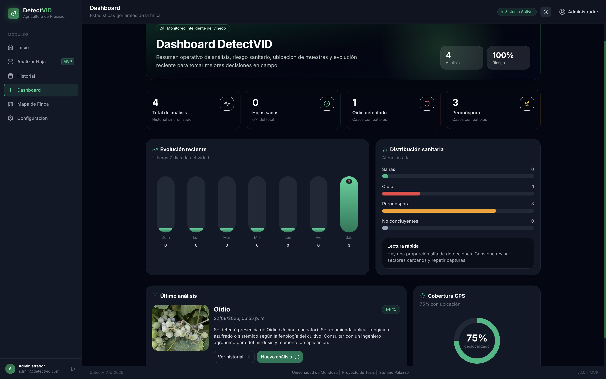
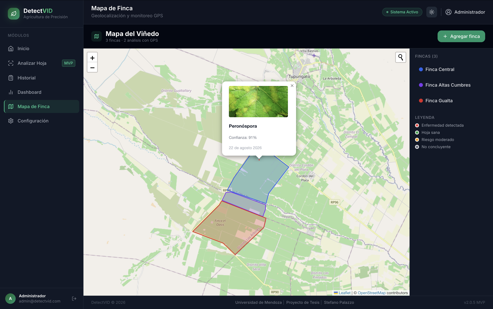
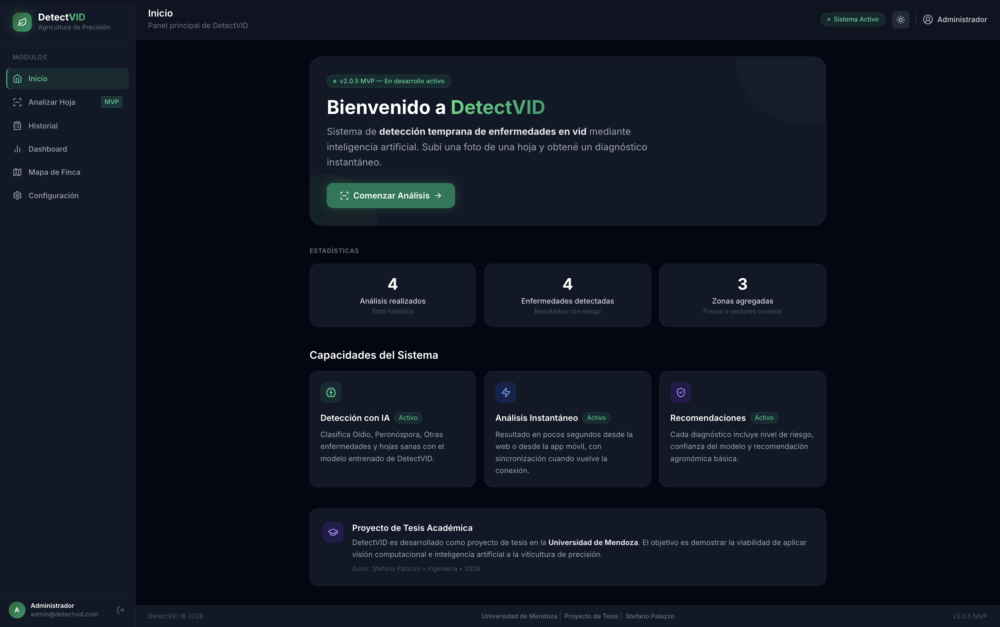

# DetectVID — detección inteligente de enfermedades en vid

[English](README.md) | **Español**

DetectVID es una plataforma AgriTech para monitorear viñedos mediante análisis de imágenes de hojas de vid. Permite subir o capturar una foto, ejecutar inferencia con un modelo de visión computacional, guardar el diagnóstico, revisar el historial, consultar métricas y ubicar análisis y fincas en un mapa.

Proyecto final de Ingeniería en Informática — Universidad de Mendoza — Stefano Palazzo.

## Vista del producto



<details>
<summary>Ver más capturas</summary>

### Mapa de finca



### Inicio



</details>

> Las capturas utilizan datos de demostración.

## Arquitectura


## Estado del MVP

El MVP actual incluye:

- Autenticación con JWT en cookie HttpOnly.
- Frontend web React/Vite protegido por sesión.
- Backend Express + Prisma + PostgreSQL.
- API ML FastAPI/PyTorch reemplazable por otro motor de inferencia.
- Subida de imágenes con filtrado de MIME/tipo y tamaño, más almacenamiento local persistente o Cloudinary.
- Historial con miniaturas, filtros, agrupación por día/semana/mes y borrado.
- Dashboard con métricas calculadas desde análisis reales.
- Mapa Leaflet con fincas, polígonos y puntos GPS de análisis.
- App mobile Kotlin Multiplatform con cola offline persistente y sincronización en primer plano.
- Docker Compose para VM o desarrollo local.

## Stack

| Capa | Tecnología |
|---|---|
| Web | React 18, Vite 5, Tailwind CSS, React Router, Framer Motion, Leaflet |
| Backend | Node.js 20, Express, Prisma, PostgreSQL, JWT, bcrypt, multer |
| API ML | Python 3.10, FastAPI, PyTorch, torchvision, Pillow |
| Mobile | Kotlin Multiplatform, Compose Multiplatform, Android/iOS shell |
| Despliegue | Docker Compose, Nginx reverse proxy |

## Estructura

```text
DetectVID/
├── frontend/          # SPA web React + configuración Nginx
├── backend/           # API Express, autenticación, análisis, fincas, Prisma
├── ml/                # Entrenamiento, evaluación y API FastAPI de inferencia
├── mobile/            # App KMP Android/iOS offline-first
├── docs/              # Arquitectura y despliegue
├── docker-compose.yml # Stack local/VM
└── .env.example       # Variables para Docker/VM
```

## Variables de entorno

Para Docker/VM:

```bash
cp .env.example .env
```

Variables principales:

| Variable | Uso |
|---|---|
| `POSTGRES_USER`, `POSTGRES_PASSWORD`, `POSTGRES_DB` | Base PostgreSQL |
| `JWT_SECRET` | Firma JWT; usar un valor largo y aleatorio |
| `COOKIE_SECURE` | `false` solo para HTTP local; usar `true` con HTTPS |
| `PUBLIC_BASE_URL` | URL pública usada para imágenes locales, ej. `https://detectvid.example.com` |
| `FRONTEND_URLS` | Orígenes CORS permitidos separados por coma |
| `STORAGE_PROVIDER` | `local` para VM, `cloudinary` opcional |
| `MODEL_EXPERIMENT_ID` | ID del modelo de despliegue; por defecto `exp44_4cls_field_eff_quality_aug` |

Para desarrollo backend sin Docker:

```bash
cp backend/.env.example backend/.env
```

## Ejecutar con Docker

```bash
docker compose up -d --build
```

Compose exige `POSTGRES_PASSWORD` y `JWT_SECRET`; no incluye credenciales predeterminadas. Para desarrollo local, copia `.env.example` a `.env` y completa esos valores antes de iniciar los servicios.

Servicios:

- Frontend/Nginx: http://localhost
- Backend health: http://localhost/api/auth/me requiere sesión; health interno: `backend:3001/health`
- ML health mediante proxy: http://localhost/api/ml/health
- PostgreSQL: contenedor interno `db`

Ver logs:

```bash
docker compose logs -f
```

Detener:

```bash
docker compose down
```

## Ejecutar en desarrollo local

### Backend

```bash
cd backend
npm install
cp .env.example .env
npm run db:generate
npm run db:migrate
# Definir SEED_ADMIN_EMAIL y SEED_ADMIN_PASSWORD en backend/.env antes del seed.
npm run db:seed
npm run dev
```

Backend: http://localhost:3001

### API ML

```bash
cd ml
python3 -m venv .venv
source .venv/bin/activate
pip install -r requirements.txt
uvicorn api.main:app --reload --port 8000
```

ML health: http://localhost:8000/api/ml/health

### Frontend

```bash
cd frontend
npm install
npm run dev
```

Frontend: http://localhost:5173

## Flujo de análisis

1. El usuario selecciona una imagen JPG, PNG o WEBP.
2. La web filtra por MIME/tipo declarado y tamaño, y muestra una vista previa; no realiza validación de contenido de la imagen.
3. Se intenta extraer GPS EXIF o la ubicación del dispositivo.
4. `frontend/src/services/mlService.js` envía la imagen a `/api/ml/predict`.
5. La API ML devuelve clase, confianza, margen e incertidumbre.
6. El frontend muestra el resultado, riesgo y recomendación.
7. `frontend/src/services/analysisService.js` guarda la imagen y el resultado en `/api/analyses`.
8. Historial, dashboard y mapa consumen esos análisis guardados.

## Conectar o reemplazar el modelo

La frontera estable está en:

- Web: `frontend/src/services/mlService.js`
- API ML: `ml/api/services/model_service.py`
- Contrato de respuesta: `ml/api/schemas/prediction.py`

Mientras el endpoint devuelva `predicted_class`, `confidence`, `probabilities`, `is_uncertain` y `top1_margin`, el frontend no necesita cambios.

### Artefactos de modelo y registros experimentales

Los binarios de checkpoints, datasets, manifests y artefactos de resultados de experimentos no se guardan intencionalmente en Git. La inferencia requiere un checkpoint `.pth` provisto externamente en `ml/checkpoints` que coincida con `MODEL_EXPERIMENT_ID`; actualmente no existe una descarga pública estable. Las métricas informadas son registros experimentales locales, no benchmarks reproducibles públicamente.

## Mobile

Abrir `mobile/` en Android Studio para Android. Para iOS, abrir:

```text
mobile/iosApp/DetectVID.xcodeproj
```

La app mobile guarda imágenes en el sandbox local, mantiene una cola offline persistente y sincroniza en primer plano con:

- `POST /api/ml/predict`
- `POST /api/analyses`
- `GET /api/analyses?limit=100`

Más detalles en `mobile/README.md`. No se garantiza sincronización en segundo plano ni sin conexión.

## Limitaciones conocidas

- El checkpoint de inferencia no está versionado y debe proveerse externamente.
- La validación de campo y de generalización sigue pendiente.
- Los umbrales de incertidumbre son heurísticos y no están calibrados.
- La sincronización mobile funciona en primer plano; no hay garantía de entrega en segundo plano/sin conexión.
- El endurecimiento del límite directo de la API ML, rate limiting y autenticación queda fuera del alcance del MVP.

## Checks útiles

```bash
npm --prefix frontend run build
npm --prefix backend run db:generate
python3 -m py_compile ml/src/*.py ml/api/services/*.py ml/api/*.py
cd mobile && ./gradlew --no-daemon :composeApp:assembleDebug :composeApp:compileKotlinIosSimulatorArm64
```

## Despliegue en VM

Ver `docs/DEPLOYMENT_VM.md`.

## Documentación adicional

- `docs/ARCHITECTURE.md` — arquitectura general.
- `docs/DEPLOYMENT_VM.md` — guía paso a paso para VM.
- `docs/IMPLEMENTATION_REPORT.md` — cambios recientes y validación.
- `ml/docs/EXPERIMENTS.md` — guía de experimentos ML.
