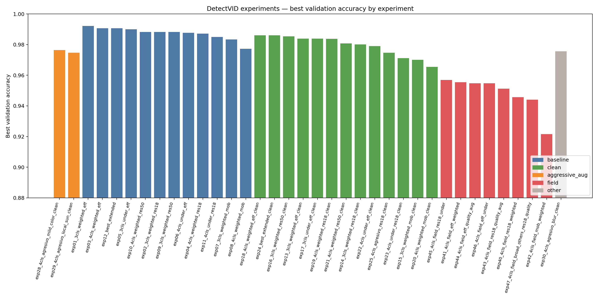
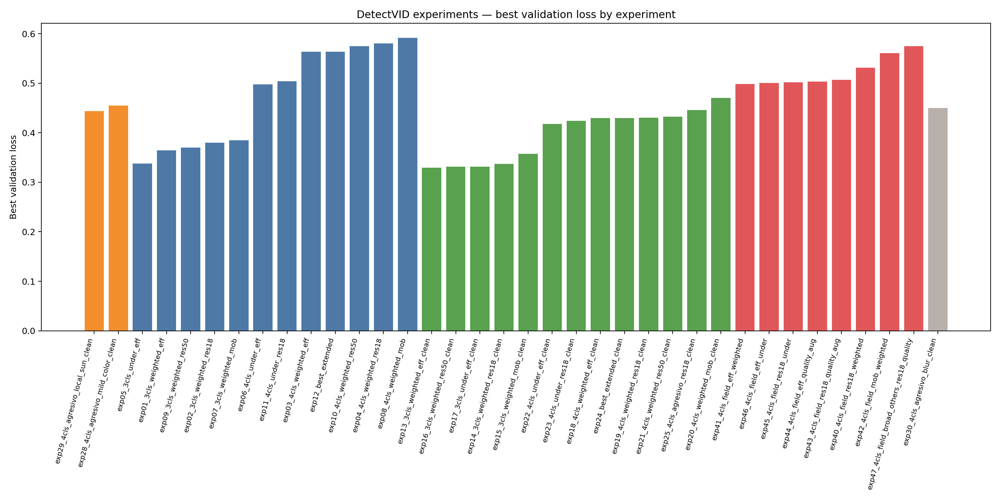
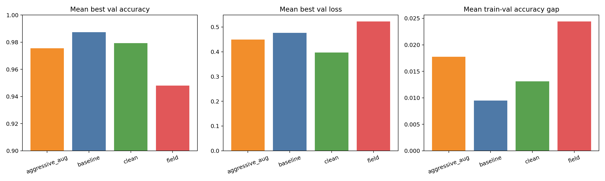
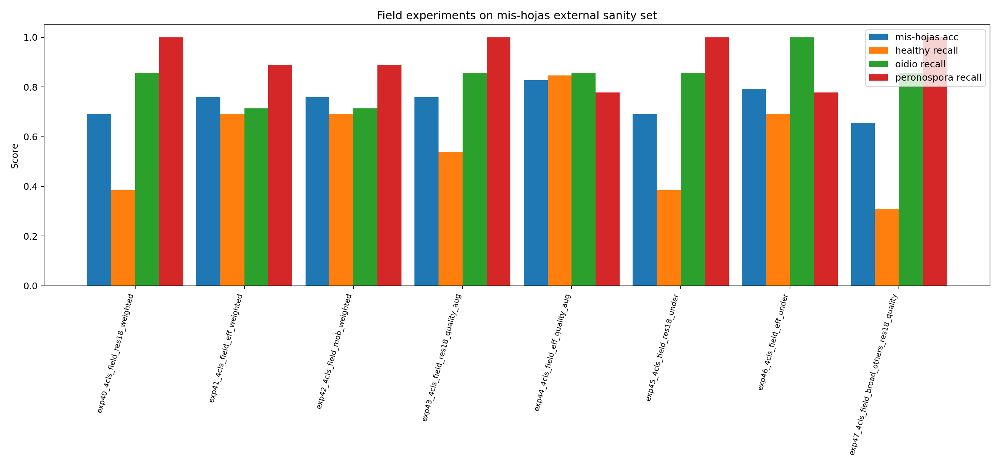
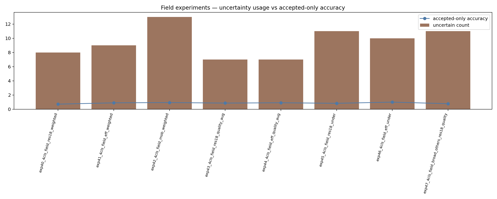

# DetectVID — análisis de resultados y tendencias

Este documento resume qué pasó en los experimentos que sí tienen artefactos en `/Users/stefanopalazzo/Projects/DetectVID/ml/results`.

## Respuesta corta

Si la pregunta es **“qué línea parece mejor para producción hoy”**, la respuesta es:

- **4 clases**
- **dataset curado de campo / close-up**
- **EfficientNet-B0**
- **quality augmentation moderado**
- **regla de `uncertain` activada**

El experimento que mejor representa eso es:

- `exp44_4cls_field_eff_quality_aug`

---

## Gráficos

## Mejor validation accuracy por experimento

## Mejor validation loss por experimento

## Tendencias promedio por familia

## Experimentos de campo sobre `mis-hojas`

## Incertidumbre vs accuracy aceptado

---

## 1. Tendencias generales

## Tendencia A — las métricas internas históricas son MUY altas
En las familias baseline y clean hay muchísimos experimentos con:

- `best_val_acc` entre `0.97` y `0.99`

Eso suena espectacular, pero hay que leerlo con cuidado.

### Qué significa realmente
Significa que el modelo aprendió muy bien el universo de esos splits.
No significa necesariamente que generalice bien a fotos reales de campo que el usuario sube con celular.

## Tendencia B — la familia `field` baja en validación interna, pero es más honesta
Promedio por familia:

| Familia | Mean best val acc | Mean best val loss | Mean gap train-val |
|---|---:|---:|---:|
| baseline | 0.9874 | 0.4759 | 0.0095 |
| clean | 0.9793 | 0.3973 | 0.0131 |
| aggressive_aug | 0.9756 | 0.4493 | 0.0178 |
| field | 0.9481 | 0.5222 | 0.0244 |

### Interpretación
La familia `field` parece “peor” si mirás solo validación interna.
Pero en realidad está resolviendo un problema más difícil y más parecido al uso real.

Eso es una BUENA señal, no una mala.

## Tendencia C — `clean` fue una decisión correcta
Sacar fondos planos y shortcuts de laboratorio bajó un poco algunas métricas internas, pero limpió el problema.
Eso es más sano para producción.

## Tendencia D — `others` demasiado amplio puede romper `healthy`
El experimento `exp47_4cls_field_broad_others_res18_quality` mostró que ampliar `others` con fuentes más ruidosas puede empeorar mucho healthy.

---

## 2. Análisis por familia

## Familia 1 — baseline (`exp01` a `exp12`)

### Qué buscaba
Comparar arquitecturas, 3 vs 4 clases, y weighted vs undersampled sobre el universo original + zenodo mezclado.

### Qué mostró
- EfficientNet-B0 fue muy fuerte desde el principio.
- MobileNet fue el más flojo en métricas internas.
- ResNet50 no justificó una ventaja clara que compense su mayor tamaño.
- `exp03` y `exp12` tienen historial idéntico guardado.

### Descubrimiento importante
`exp12_best_extended_history.json` es **idéntico** a `exp03_4cls_weighted_eff_history.json`.
Entonces hoy conviene documentarlo como:

- reuso/copia del historial del ganador
- no como evidencia independiente de una corrida distinta

---

## Familia 2 — clean (`exp13` a `exp25`)

### Qué buscaba
Repetir la comparación sin permitir shortcuts de laboratorio o sesgos de fondos planos.

### Qué mostró
- EfficientNet siguió siendo una base muy fuerte.
- ResNet18 quedó cerca en varias comparaciones.
- MobileNet volvió a quedar por detrás.
- `exp18` y `exp24` también tienen historial idéntico guardado.

### Lectura correcta
Esta familia importa más que la baseline para tesis y producto porque ataca el problema conceptual correcto:

> que el modelo aprenda síntomas de enfermedad, no fondos o contexto artificial.

---

## Familia 3 — aggressive augmentation (`exp25`, `exp28`, `exp29`, `exp30`)

### Qué buscaba
Forzar más robustez visual con crops agresivos y perturbaciones tipo color, glare o blur.

### Qué mostró
- no hubo una mejora revolucionaria
- el aumento de robustez vino con más épocas y más gap
- no superó claramente a la línea field curada posterior

### Lectura correcta
La intuición fue buena, pero el orden óptimo no era “más augmentation primero”.
El orden correcto era:

1. limpiar dominio
2. curar close-up field
3. recién ahí ajustar augmentations

---

## Familia 4 — field (`exp40` a `exp47`)

### Qué buscaba
Aproximar mejor el escenario real de producción:

- fotos close-up
- healthy lejano fuera del entrenamiento principal
- fondos planos excluidos
- fuentes preservadas cuando ya venían splitteadas

### Qué mostró
Esta es la familia más útil para producto hoy.

---

## 3. Ranking de los experimentos de campo sobre `mis-hojas`

| Experimento | Acc | Healthy recall | Oidio recall | Peronospora recall | Healthy disease FP rate | Uncertain |
|---|---:|---:|---:|---:|---:|---:|
| `exp44_4cls_field_eff_quality_aug` | **0.8276** | **0.8462** | 0.8571 | 0.7778 | **0.1538** | 7 |
| `exp46_4cls_field_eff_under` | 0.7931 | 0.6923 | **1.0000** | 0.7778 | 0.2308 | 10 |
| `exp41_4cls_field_eff_weighted` | 0.7586 | 0.6923 | 0.7143 | 0.8889 | 0.3077 | 9 |
| `exp42_4cls_field_mob_weighted` | 0.7586 | 0.6923 | 0.7143 | 0.8889 | 0.2308 | 13 |
| `exp43_4cls_field_res18_quality_aug` | 0.7586 | 0.5385 | 0.8571 | **1.0000** | 0.4615 | 7 |
| `exp40_4cls_field_res18_weighted` | 0.6897 | 0.3846 | 0.8571 | **1.0000** | 0.6154 | 8 |
| `exp45_4cls_field_res18_under` | 0.6897 | 0.3846 | 0.8571 | **1.0000** | 0.6154 | 11 |
| `exp47_4cls_field_broad_others_res18_quality` | 0.6552 | 0.3077 | 0.8571 | **1.0000** | 0.6154 | 11 |

---

## 4. Qué experimento elegir según el objetivo

## Si querés el mejor balance general
Elegí:

- `exp44_4cls_field_eff_quality_aug`

### Por qué
- mejor accuracy general en `mis-hojas`
- mejor healthy recall
- menor tasa de falso positivo de enfermedad sobre healthy
- buen oidio recall
- calidad de generalización razonable

## Si querés máxima sensibilidad para oidio
Elegí:

- `exp46_4cls_field_eff_under`

### Tradeoff
- detecta mejor oidio
- pero no gana el balance general
- y usa más rechazos / incertidumbre

## Si priorizás peronospora
`exp43`, `exp40`, `exp45`, `exp47` llegaron a `1.0` en peronospora sobre este sanity set.

### Problema
En varios de ellos healthy colapsa. Entonces no son buenos candidatos generales.

---

## 5. Diferencias importantes entre arquitecturas

## EfficientNet-B0
### Lo que se ve en el repo
- fue fuerte en baseline
- fue fuerte en clean
- fue el mejor en field con `exp44`

### Interpretación
Sigue siendo la arquitectura más confiable del proyecto para este dataset.

## ResNet18
### Lo que se ve en el repo
- compite bien en entrenamiento
- puede detectar muy bien enfermedad
- pero en field tiende a castigar healthy más que EfficientNet

### Interpretación
Es una muy buena línea de control, pero no parece la mejor candidata final hoy.

## MobileNet-V3
### Lo que se ve en el repo
- más liviano
- desempeño medio o inferior en casi todas las comparaciones importantes

### Interpretación
Puede servir si deployment móvil extremo pesa más que accuracy.
Hoy no parece la mejor línea principal.

## ResNet50
### Lo que se ve en el repo
- no mostró una superioridad clara frente a EfficientNet o ResNet18

### Interpretación
Más capacidad no resolvió el cuello de botella principal, porque el problema no era solamente de arquitectura sino de dominio y curación.

---

## 6. Qué aprendimos sobre augmentation

## Lo que SÍ ayudó
El **quality augmentation moderado** (`exp43`, `exp44`) sí aportó valor, especialmente en la línea EfficientNet.

## Lo que NO resolvió solo
La augmentation agresiva no arregla por sí sola:

- etiquetas malas
- healthy lejano mezclado con healthy close-up
- otros datasets con ruido o watermark fuerte
- `others` demasiado heterogéneo

## Regla conceptual correcta
Primero mejorá el dataset.
Después ajustá augmentation.
No al revés.

---

## 7. Qué aprendimos sobre `others`

Agregar una cuarta clase fue una decisión correcta para producto.

### Por qué
Un modelo de 3 clases se ve obligado a mentir:

- todo lo desconocido termina en healthy, oidio o peronospora

Con `others` ganás una salida más honesta.

### Pero cuidado
Si `others` se vuelve demasiado amplio, ruidoso o fuera de dominio, empieza a competir contra healthy y contra las clases objetivo.

Eso es exactamente lo que sugieren los resultados de `exp47`.

---

## 8. Qué significa esto para la app

La combinación más sensata hoy es:

- modelo de 4 clases
- `others` como clase explícita
- `uncertain` como decisión de seguridad en inferencia

Eso evita dos mentiras comunes:

1. “esto es oidio/peronospora” cuando en realidad no coincide con ninguna clase conocida
2. “estoy seguro” cuando la foto no da evidencia suficiente

---

## 9. Recomendación final

## Modelo principal recomendado hoy
- `exp44_4cls_field_eff_quality_aug`

## Modelo alternativo para comparar
- `exp46_4cls_field_eff_under`

## Modelo de control útil
- `exp43_4cls_field_res18_quality_aug`

## Próximo foco de mejora
No seguir probando arquitecturas al azar.
El cuello de botella más grande sigue siendo:

- la definición visual de `healthy`
- la calidad y curación de `others`
- y la cobertura de close-ups de campo reales

## Siguiente lectura

- `/Users/stefanopalazzo/Projects/DetectVID/ml/docs/EXPERIMENT_APPENDIX.md`
