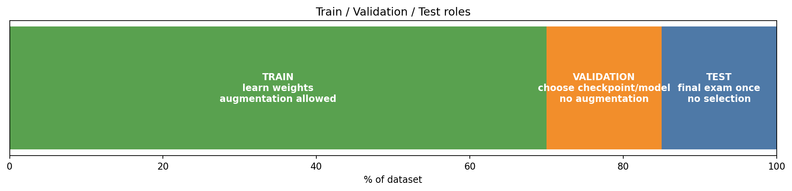

# DetectVID — intensive ML and computer vision crash course

This guide teaches the minimum machine learning and computer vision concepts needed to understand DetectVID's experiments and defend them academically.

## 1. What a machine learning model learns

A model does not “understand grapevine disease” like a human. It learns statistical visual patterns from examples.

For DetectVID:

```text
image pixels → CNN backbone → feature vector → classifier head → probabilities
```

Example output:

```json
{
  "healthy": 0.05,
  "oidio": 0.82,
  "peronospora": 0.10,
  "others": 0.03
}
```

The predicted class is usually the largest probability: `oidio`.

## 2. Train, validation and test



| Split | Used for | Can influence model choice? | Uses augmentation? |
|---|---|---:|---:|
| Train | Update weights | Yes, indirectly | Yes |
| Validation | Choose checkpoint/model | Yes | No |
| Test | Final evaluation | No | No |

### Construction analogy

- **Train**: where workers build the house.
- **Validation**: where the architect checks progress and decides what design works.
- **Test**: final inspection. If you redesign the house after seeing the final inspection, that inspection is no longer independent.

## 3. What is a class?

DetectVID has used 3-class and 4-class setups.

### 3-class

```text
healthy
oidio
peronospora
```

Problem: if the image is another disease, the model must lie and force it into one of those three.

### 4-class

```text
healthy
oidio
peronospora
others
```

Better for production because `others` gives the model a valid place for diseases/damage that are not oidio/peronospora.

## 4. What is loss?

Loss measures how bad the prediction is. Lower is better.

A wrong confident prediction has high loss.

Example:

| Real class | Prediction | Accuracy | Loss intuition |
|---|---|---:|---:|
| oidio | oidio 0.95 | correct | low |
| oidio | oidio 0.51 | correct | medium |
| oidio | healthy 0.95 | wrong | very high |

This is why validation loss is often better than accuracy for choosing checkpoints: it also cares about confidence/calibration.

## 5. What is accuracy?

Accuracy is:

```text
correct predictions / total predictions
```

Accuracy is easy to understand, but dangerous with imbalanced classes.

If 80% of images are healthy, a dumb model can predict healthy always and get high accuracy while failing disease detection.

## 6. Precision, recall and F1

For each class:

### Precision

“When the model says oidio, how often is it actually oidio?”

Useful when false alarms are expensive.

### Recall

“Of all real oidio images, how many did the model catch?”

Useful when missing disease is expensive.

### F1

Balance between precision and recall.

### F1 macro

Average F1 across classes, giving each class equal importance.

This matters because DetectVID has class imbalance.

## 7. Confusion matrix

A confusion matrix shows what the model confuses with what.

Example:

| Real \ Pred | healthy | oidio | peronospora | others |
|---|---:|---:|---:|---:|
| healthy | 90 | 8 | 2 | 0 |
| oidio | 3 | 80 | 10 | 7 |
| peronospora | 1 | 12 | 82 | 5 |
| others | 10 | 4 | 6 | 80 |

Read rows as real class. Read columns as prediction.

If healthy row has many oidio/peronospora predictions, the model is over-diagnosing disease.

## 8. What is overfitting?

Overfitting means the model memorizes train data instead of learning general disease signs.

Symptoms:

- train loss keeps falling
- validation loss stops improving or rises
- train accuracy is much higher than validation accuracy

## 9. What is underfitting?

Underfitting means the model is not learning enough.

Symptoms:

- train loss remains high
- validation loss remains high
- both train and validation accuracy are low

## 10. What is a good fit?

A good model usually has:

- low train loss
- low validation loss
- train and validation curves reasonably close
- strong F1 macro
- acceptable per-class behavior

But “close curves” alone is not enough. If both losses are close but high, that is underfitting.

## 11. Data augmentation

Data augmentation means random transformations applied only to training images.

Examples in DetectVID:

- flips
- random crops
- color jitter
- local sun glare simulation
- Gaussian blur
- random erasing

### Why train only?

Because augmentation teaches robustness. It is not the real evaluation condition.

Validation/test/user images should not be randomly transformed.

## 12. Transfer learning

DetectVID uses CNN backbones pretrained on ImageNet.

This helps because early CNN layers already know useful visual features:

- edges
- textures
- shapes
- color gradients

Then DetectVID fine-tunes the model for grapevine disease classes.

## 13. Architectures in your experiments

| Model | Role |
|---|---|
| EfficientNet-B0 | Strong accuracy/parameter baseline; currently best practical family. |
| ResNet18 | Fast, classic, reliable baseline. |
| MobileNet-V3 | Lightweight deployment candidate, usually weaker here. |
| ResNet50 | Larger model; did not clearly beat smaller options. |

## 14. What makes computer vision hard here

Grapevine disease classification is hard because:

- symptoms can be subtle
- healthy leaves vary a lot
- lighting changes color
- internet images contain watermarks/text/backgrounds
- disease signs can appear on leaves or grapes
- different diseases can look similar
- close-up vs distant photos are different domains

## 15. Most important lesson

Architecture is not the biggest bottleneck anymore.

For DetectVID, dataset quality and evaluation methodology matter more than trying random new models.
