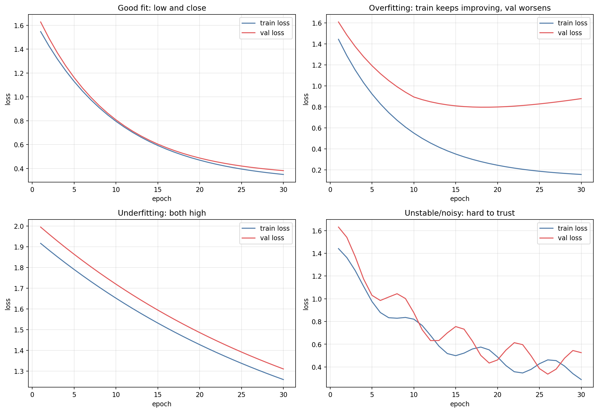
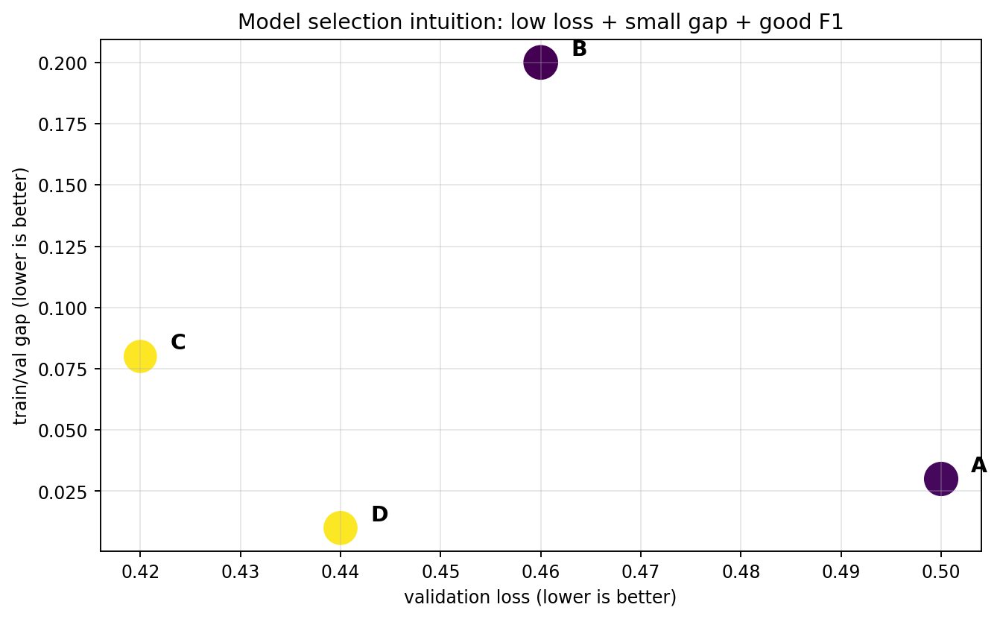

# DetectVID — model selection and learning curves guide

This guide explains how to choose a model using train/validation curves, validation loss, F1, overfitting evidence and class behavior.

## Quick rule

Choose the model with:

1. low validation loss
2. train and validation loss reasonably close
3. no strong overfitting trend
4. good validation macro-F1
5. good per-class confusion matrix
6. accuracy only as secondary evidence

Do not choose using test.

## Learning curve scenarios



## 1. Good fit

Pattern:

- train loss goes down
- validation loss goes down
- gap is small/moderate
- both end low

Interpretation:

> The model is learning patterns that transfer to unseen validation data.

This is usually what you want.

## 2. Overfitting

Pattern:

- train loss keeps going down
- validation loss bottoms out, then rises
- train accuracy rises far above validation accuracy

Interpretation:

> The model is memorizing training data.

What to do:

- use earlier checkpoint at lowest validation loss
- more clean data
- more appropriate augmentation
- stronger regularization
- reduce model complexity

## 3. Underfitting

Pattern:

- train loss high
- validation loss high
- both curves close

Important: close curves are not automatically good. If both are high, the model is bad but consistently bad.

What to do:

- train longer
- increase model capacity
- improve learning rate
- check labels/preprocessing
- reduce excessive augmentation

## 4. Noisy/unstable curves

Pattern:

- validation loss jumps a lot
- no clear trend

Possible causes:

- validation set too small
- learning rate too high
- labels noisy
- data pipeline too random
- source leakage/noise

## 5. Your intuition: “curves close and low”

Your intuition is basically correct, but incomplete.

The best model is not simply “smallest gap”. It is:

```text
low validation loss + acceptable gap + good class metrics
```

Why?

| Case | Train loss | Val loss | Gap | Good? |
|---|---:|---:|---:|---|
| A | 0.20 | 0.24 | 0.04 | Good |
| B | 0.80 | 0.82 | 0.02 | Bad: underfitting |
| C | 0.10 | 0.70 | 0.60 | Bad: overfitting |
| D | 0.35 | 0.38 | 0.03 | Possibly good |

So yes: close matters. But low matters too.

## 6. Why validation loss is prioritized

Validation loss captures:

- correctness
- confidence
- calibration

Accuracy only captures correct/incorrect.

Example:

| Model | Accuracy | Validation loss | Meaning |
|---|---:|---:|---|
| A | 90% | 0.35 | confident and mostly correct |
| B | 90% | 0.80 | same accuracy but poorly calibrated/overconfident |

Prefer A.

## 7. Why F1 macro matters

DetectVID has imbalanced classes. Accuracy can hide failures on small classes.

Macro-F1 gives each class equal weight.

This is important for:

- oidio
- peronospora
- healthy false positives
- others rejection

## 8. How to inspect a future experiment

For experiment `exp44_..._repro_seed42`, inspect:

```text
ml/results/exp44_..._repro_seed42_history.json
ml/results/exp44_..._repro_seed42_training_curves.png
ml/results/exp44_..._repro_seed42_val_confusion_matrix.csv
ml/results/exp44_..._repro_seed42_val_confusion_matrix.png
ml/results/exp44_..._repro_seed42_metrics.json
ml/results/exp44_..._repro_seed42_metadata.json
```

Then compare all models with:

```text
ml/results/field_repro_final_summary.csv
ml/results/field_repro_final_summary.md
```

## 9. Model selection tradeoff visual



Ideal models live toward:

- left: lower validation loss
- bottom: smaller train/val gap
- larger marker: better F1 macro

## 10. Practical selection checklist

For each candidate:

- [ ] Is validation loss low relative to other models?
- [ ] Did validation loss improve smoothly?
- [ ] Is train loss much lower than validation loss? If yes, overfitting risk.
- [ ] Is both train and validation loss high? If yes, underfitting.
- [ ] Is macro-F1 strong?
- [ ] Does healthy get over-diagnosed as disease?
- [ ] Does oidio recall stay acceptable?
- [ ] Does peronospora recall stay acceptable?
- [ ] Is `others` helping or stealing healthy/disease examples?
- [ ] Was test kept untouched until final selection?

## 11. Final model protocol

1. Run all reproducible experiments.
2. Compare validation summaries and curves.
3. Pick one model.
4. Only then evaluate test once:

```bash
python src/experiments.py \
  --suite field_repro \
  --experiment <chosen_experiment_id> \
  --evaluate-test \
  --no-wandb
```

If you evaluate test for every model and choose based on test, test stops being a final exam.
