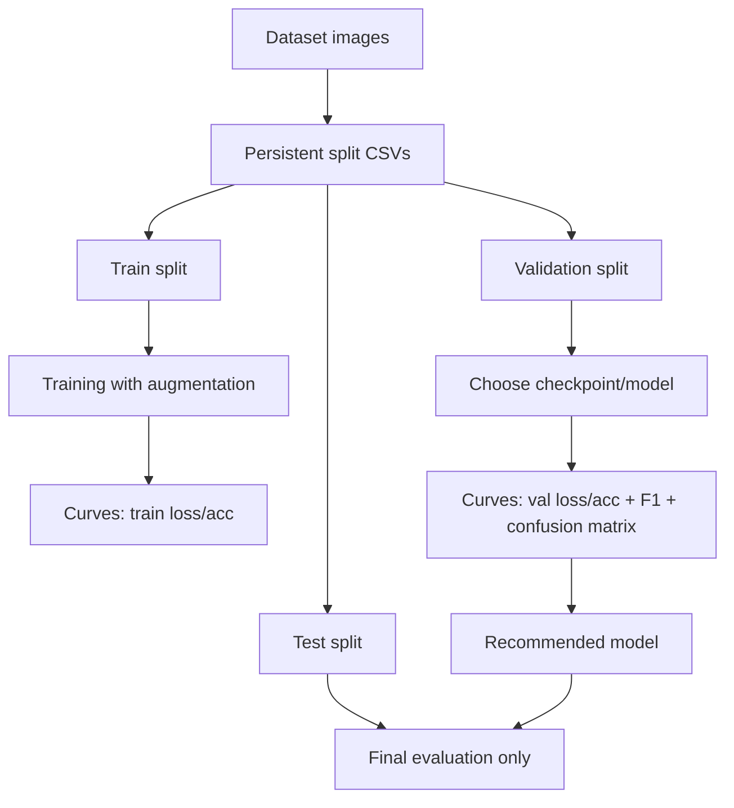

# DetectVID — start here: ML, computer vision and experiments

This is the recommended reading path if you are starting from zero and want to understand DetectVID's models, experiments, curves, metrics and reproducibility decisions.

## Quick answer

Read in this order:

1. `START_HERE_ML_CV.md` — this file. Big-picture map.
2. `ML_CV_INTENSIVE_COURSE.md` — crash course: train/val/test, loss, accuracy, F1, overfitting, augmentation, CNNs.
3. `MODEL_SELECTION_AND_CURVES_GUIDE.md` — how to read train/validation curves and choose a model.
4. `EXPERIMENT_METHODOLOGY.md` — how DetectVID trains/evaluates in code.
5. `EXPERIMENT_APPENDIX.md` — what each experiment changes.
6. `EXPERIMENT_ANALYSIS.md` — what the previous results showed.
7. `REPRODUCIBLE_EXPERIMENTS_REPORT.md` — what changed to make future comparisons defensible.
8. `DATASET_CURATION_GUIDE.md` — where images should go and what should/should not train.

## Mental map



## What you should understand first

| Concept | One-sentence version |
|---|---|
| Train | Images used to update model weights. |
| Validation | Images used during development to choose checkpoint/model. |
| Test | Final exam; do not use it to choose the model. |
| Loss | How wrong/confident the model is; lower is better. |
| Accuracy | Percent correct; useful but can hide class problems. |
| F1 macro | Balances precision/recall across classes; better for imbalanced datasets. |
| Overfitting | Model memorizes train data and fails validation. |
| Underfitting | Model cannot learn train or validation well. |
| Data augmentation | Random training-only image variations to improve robustness. |
| Data leakage | Train/val/test accidentally share the same or near-same information. |

## Your project-specific model recommendation status

Before reproducible reruns, the best practical model was:

- `exp44_4cls_field_eff_quality_aug`

But after the reproducibility fix, you should rerun:

```bash
cd /Users/stefanopalazzo/Projects/DetectVID/ml
source .venv/bin/activate
python src/experiments.py --suite field_repro --no-wandb
python src/summarize_experiments.py \
  --prefix exp4 \
  --output results/field_repro_final_summary.csv \
  --markdown results/field_repro_final_summary.md
```

Then choose from the `_repro_seed42` experiments using validation metrics and curves.

## Important warning

Do not use test metrics to choose between experiments. Use validation. Test is only for the final selected model.
